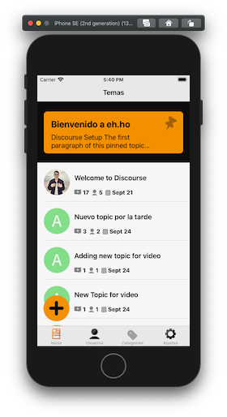
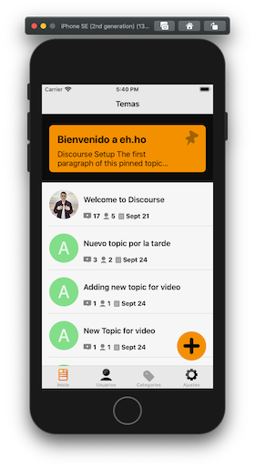
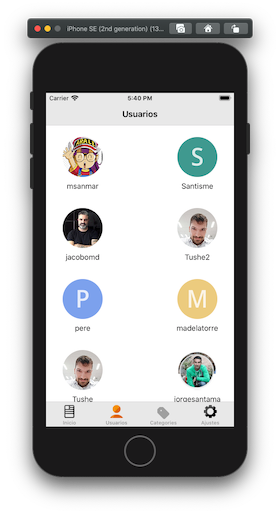
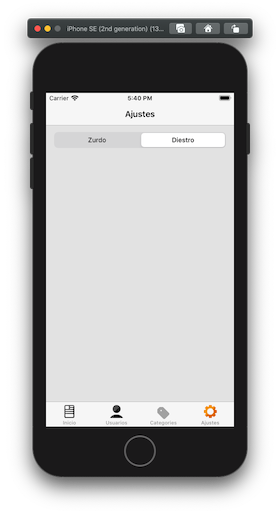

# Práctica de UI Avanzada

Partiendo de la aplicación realizada en el módulo de _Concurrencia y Red_, aplicar el nuevo diseño realizado en el módulo de _UX Móvil & diseño de UI_

## Tecnologías

- Xcode
- Swift
- Sketch
- Zeplin

### Extras

- Refactorizada la vista Tema aplicando **MVVM**. El resto de la aplicación mantiene el patrón **MVC**.
- Añadida vista Ajustes para que el usuario eliga entre zurdo/diestro, de modo que el botón añadir nuevos topics en la vista temas se disponga a la izquierda o derecha. Dicha selección se persistente mediante el uso de **UserDefault**. Además los elementos visuales de la vista Ajustes están íntegramente implementados por código, **nada de xib ni storyboards**.
- Tanto en la vista Temas como en la de Ajustes se han implementado mediante código diversos **constraints**.

##### Capturas de pantallas

